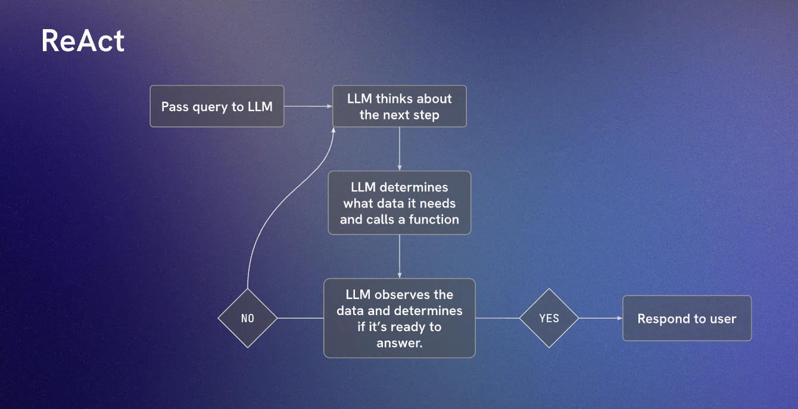

### ReAct

Reasoning + Acting

1. Reasoning: Think about what steps or additional information you might require to accomplish your task
2. Acting: Perform an action to help you get closer to your ultimate goal.
3. Observing: Observe the results of the action you performed, and start back at #1 (Reasoning) when necessary. Otherwise, give the completed response to the user.

